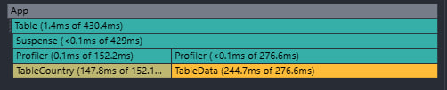
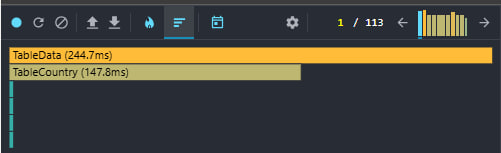
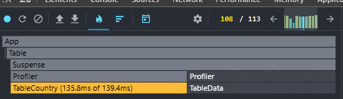
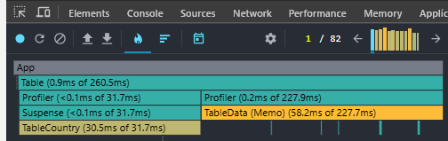
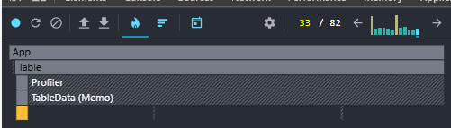
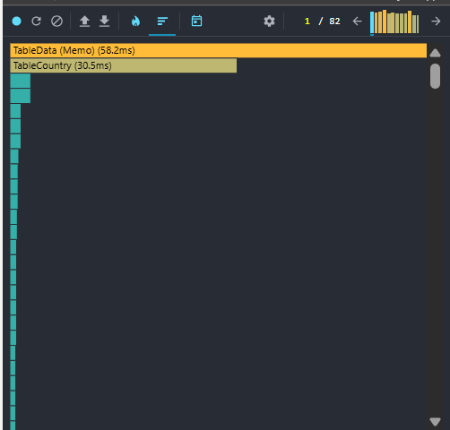
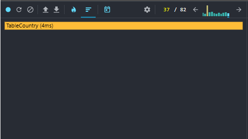

# Optimization Tests Before Implementing Hooks and React.memo

_All tests were performed on the commit: feat: add profiler_

Screenshots from React DevTools are attached below. The metrics were identical at all stages of rendering.

When interacting with specific table elements, a complete re-render of all table elements occurred simultaneously. This caused the load on both tables to remain consistent throughout all tests.

1. The country table consistently showed 200-250 ms due to the high functional load within its component.
2. The table with data for the selected country showed results around 150 ms.
   The timing here is lower because there is inherently less logic in this table. However, since this table contains data columns that remain entirely unchanged for many countries, the results could have been better.

# Optimization Tests After Implementing Hooks and React.memo

After implementing comprehensive optimization, the rendering speed increased significantly. This improvement was achieved because other elements in the tables stopped re-rendering when interactions occurred with unrelated components.

Additionally, components that maintain the same appearance for a long time were wrapped with React.memo.

At the very beginning, the increase in rendering speed isn't as noticeable, but thanks to useMemo, a significant performance boost is achieved later on. The rendering time no longer reaches 250 ms.
Now, reaching 250 ms happens rarely, and the performance mostly stays within the range of 5-50 ms.

The screenshots below will show:

1. The application launch with the initial loading of the tables.
2. The subsequent use of the application.

